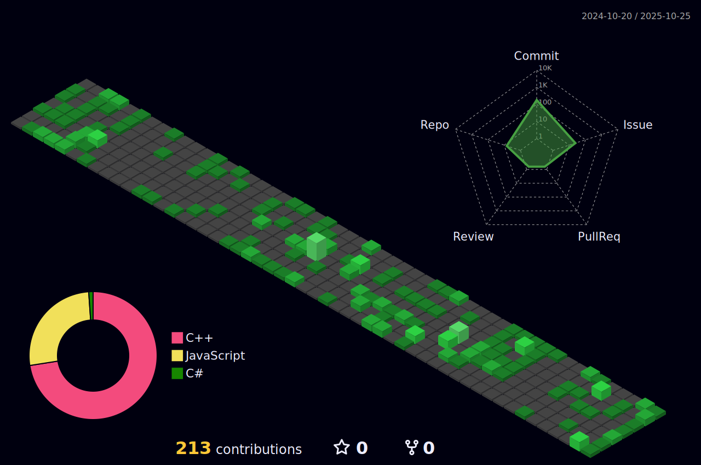

## 你是？

Misaka2298, 一名高一在读OIer, 平常喜欢上Github偷点别人的代码, 比如这个README就是偷的[HelloWRC](https://github.com/HelloWRC)的。

## 总览

## 开发

- 我主要使用的编程语言： 
  
- 我主要使用的框架： 
  
- 我主要使用的开发工具： 
  
  

## 与我联系

- 电子邮件：<Misaka2298@outlook.com>
- QQ: 2183221872

<!--
**HelloWRC/HelloWRC** is a ✨ _special_ ✨ repository because its `README.md` (this file) appears on your GitHub profile.

Here are some ideas to get you started:

- 🔭 I’m currently working on ...
- 🌱 I’m currently learning ...
- 👯 I’m looking to collaborate on ...
- 🤔 I’m looking for help with ...
- 💬 Ask me about ...
- 📫 How to reach me: ...
- 😄 Pronouns: ...
- ⚡ Fun fact: ...
-->
